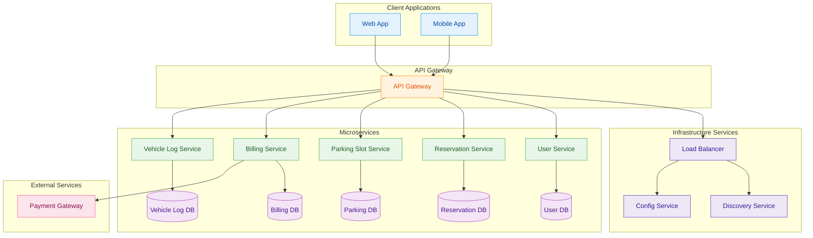

# Project Overview

## Table of Contents
- [Project Introduction](#project-introduction)
- [Modules](#modules)
- [Architecture Diagram](#architecture-diagram)
- [Technologies Used](#technologies-used)
    - [Backend](#backend)
    - [Frontend](#frontend)
    - [Other Tools and Libraries](#other-tools-and-libraries)
- [Backend Dependencies](#backend-dependencies)
- [Module Documentation](#module-documentation)
    - [User Management Module](Documentation/UserModule.md)
    - [Parking Slot Management Module](#Documentation/ParkingSlotModule.md)
    - [Vehicle Entry&Exit Logging Module](#Documentation/VehicleLogModule.md)
    - [Reservation System Module](#Documentation/ReservationModule.md)
    - [Billing and Payments Module](#Documentation/BillingModule.md)
- [How to Run This Project with Eureka and API Gateway](#how-to-run-this-project-with-eureka-and-api-gateway)
- [Project Contributors](#project-contributors)


## Project Introduction
* The Vehicle Parking Management System is a robust application crafted to optimize the management of parking spaces, streamline vehicle movements, handle reservations, and facilitate billing operations.
* It ensures a seamless experience for administrators, staff, and customers by enabling real-time slot monitoring, effortless check-ins/check-outs, and secure transactions.
* The system consists of well-defined components dedicated to user management, parking slot tracking, vehicle entry/exit logging, reservation handling, and automated billing.
* Each module is developed to work in harmony, offering a scalable, secure, and maintainable solution for efficient vehicle parking services across various facility types such as malls, offices, and residential complexes.


## Modules

-  User-Service Module - Atharva Pimple
-  Slot-Service Module - Bharadwaj M
-  Vehicle-log-Service Module - Vaishnavi P
-  Reservation-Service Module - Kapparapu Nikitha
-  Billing-Service Module - Team
## Architecture Diagram 



## Technologies Used

### Backend
- **Framework**: Spring Boot  
- **Database**: MySQL  
- **Authentication**: JWT (JSON Web Tokens)  
- **ORM**: Hibernate (via Spring Data JPA)  
- **Security**: Spring Security  
- **Build Tool**: Maven

### Frontend
- **Framework**: React.js  
- **Styling**: CSS/Tailwind  

### Other Tools and Libraries
- **Logging**: SLF4J and Logback  
- **Dependency Management**: Lombok  
- **API Documentation**: Swagger/OpenAPI  
- **Testing**: JUnit and Mockito  

## Backend Dependencies
- **Spring Boot Starter Web**: For building RESTful APIs.  
- **Spring Boot Starter Security**: For implementing authentication and authorization.  
- **Spring Boot Starter Data JPA**: For ORM and database interactions using Hibernate.  
- **Spring Boot Starter Validation**: For validating request payloads.  
- **Spring Boot Starter Test**: For testing with JUnit and Mockito.  
- **Spring Boot Starter Logging**: For logging with SLF4J and Logback.  
- **Lombok**: For reducing boilerplate code (e.g., getters, setters, constructors).  
- **JWT Utilities**: For generating and validating JSON Web Tokens.  
- **MySQL Connector**: For connecting to the MySQL database.  
- **Swagger/OpenAPI**: For API documentation and testing.  

## Module Documentation
[User Management Module](user-service\UserModule.md)

Manages user registration, login, and role-based access control for admins, staff, and customers. Ensures secure authentication and authorization processes.

[Parking Slot Management Module](slot-service/ParkingSlotModule.md)

Handles parking slot operations such as adding, updating, and checking availability. Maintains real-time status of parking slots.

[Vehicle Entry&Exit Logging Module](vehicle-log-service/VehicleLogModule.md)

Logs vehicle movements and updates parking slot statuses dynamically. Provides a seamless tracking mechanism for entry and exit.

[Reservation Management Module](https://github.com/Nikitha-Kapparapu/VPMS/blob/main/reservation-service/ReservationModule.md)

Enables users to book, modify, or cancel parking slots. Ensures smooth reservation management with real-time updates.

[Billing and Payments Module](https://github.com/Nikitha-Kapparapu/VPMS/blob/main/billing-service/BillingModule.md)

Generates bills based on parking duration and processes payments securely. Supports multiple payment methods for user convenience.

## How to Run This Project with Eureka and API Gateway

### Prerequisites
- Java 21
- Maven
- MySQL running and configured in `application.properties`
- Eureka Server (Spring Cloud Netflix Eureka)
- API Gateway (Spring Cloud Gateway)
- Spring Cloud Config Server

### Steps to Run
1. **Start Eureka Server**  
     - Clone or create a Eureka Server Spring Boot project.  
     - Run the Eureka Server:  
         ```bash
         cd eureka-server
         mvn spring-boot:run
         ```

2. **Start API Gateway Server**  
     - Clone or create an API Gateway Spring Boot project.  
     - Run the API Gateway:  
         ```bash
         cd api-gateway-server
         mvn spring-boot:run
         ```

3. **Start User Service**  
     - Clone or create the User Service Spring Boot project.  
     - Run the User Service:  
         ```bash
         cd user-service
         mvn spring-boot:run
         ```

5. **Start Slot Service**  
     - Clone or create the Slot Service Spring Boot project.  
     - Run the Slot Service:  
         ```bash
         cd slot-service
         mvn spring-boot:run
         ```

6. **Start Vehicle Log Service**  
     - Clone or create the Vehicle Log Service Spring Boot project.  
     - Run the Vehicle Log Service:  
         ```bash
         cd vehicle-log-service
         mvn spring-boot:run
         ```

7. **Start Reservation Service**  
     - Clone or create the Reservation Service Spring Boot project.  
     - Run the Reservation Service:  
         ```bash
         cd reservation-service
         mvn spring-boot:run
         ```

8. **Start Billing Service**  
     - Clone or create the Billing Service Spring Boot project.  
     - Run the Feedback Service:  
         ```bash
         cd billing-service
         mvn spring-boot:run
         ```

Once all the services are running, you can access the application through the API Gateway. Ensure that all services are registered with the Eureka Server.


# Project Contributors 

- Atharva Pimple
- Bharadwaj M
- Vaishnavi P
- Kapparapu Nikitha 


