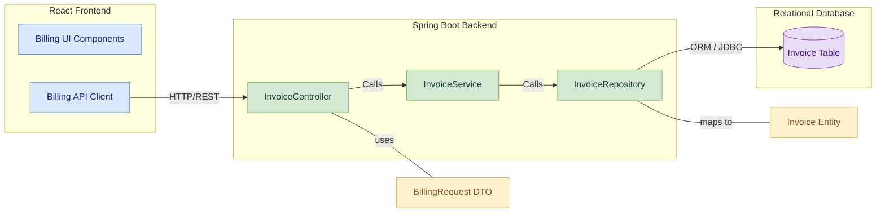

# Billing & Payments Module

## Table of Contents
- [Module Overview](#module-overview)
- [Key Features](#key-features)
- [Table Design](#table-design)
  - [Invoice Table](#invoice-table)
- [Component Diagram](#component-diagram)
- [Layered Architecture of Billing and Payments Module](#layered-architecture-of-billing-and-payments-module)
  - [1. Controller Layer](#1-controller-layer)
  - [2. Service Layer](#2-service-layer)
  - [3. Repository/Data Access Layer](#3-repositorydata-access-layer)
- [API Endpoints](#api-endpoints)
- [API Documentation](#api-documentation)

## Module Overview
The **Billing & Payments Module** is an essential part of the Vehicle Parking Management System, responsible for generating invoices for parking services and managing payment processing. It calculates parking fees based on vehicle type and duration, handles different payment methods, and manages the lifecycle of invoices from creation to payment or cancellation. This module integrates with the Reservation Service and Vehicle Log Module to accurately determine billing details.

## Key Features
- **Create Invoice:** Generates a new invoice for a parking session, either based on a completed vehicle log entry or an active reservation. It calculates the amount based on vehicle type and duration, setting the initial status as `UNPAID`.
- **Get Invoice by ID:** Allows users and staff to retrieve details of a specific invoice.
- **Get All Invoices:** Provides administrators and staff with a comprehensive list of all invoices generated in the system.
- **Get Invoices by User ID:** Enables users, staff, and administrators to view all invoices associated with a specific user.
- **Pay Invoice:** Processes payments for outstanding invoices, updating their status to `PAID` and recording the payment method. Includes checks to prevent paying cancelled or already paid invoices.
- **Cancel Invoice:** Allows cancellation of unpaid invoices, updating their status to `CANCELLED`. Prevents cancellation of already paid invoices.

## Table Design

### Invoice Table
| Column Name      | Data Type     | Constraints                        | Description                                     |
|------------------|---------------|------------------------------------|-------------------------------------------------|
| **invoiceId** | BIGINT        | Primary Key, Auto Increment        | Unique identifier for the invoice               |
| **userId** | BIGINT        | Not Null                           | Identifier of the user associated with the invoice |
| **reservationId**| BIGINT        | Nullable, Foreign Key (Reservation) | ID of the linked reservation (if applicable)    |
| **logId** | BIGINT        | Nullable, Foreign Key (Vehicle Log)| ID of the linked vehicle log (if applicable)    |
| **type** | VARCHAR(10)   | Not Null                           | Type of parking (e.g., "2W", "4W") for billing calculation |
| **amount** | DOUBLE        | Not Null                           | Calculated parking fee for the invoice          |
| **paymentMethod**| VARCHAR(50)   | Not Null, Enum (e.g., `CASH`, `CARD`, `UPI`) | Method used for payment                         |
| **status** | VARCHAR(50)   | Not Null, Enum (`UNPAID`, `PAID`, `CANCELLED`) | Current status of the invoice               |
| **timestamp** | DATETIME      | Not Null                           | Date and time the invoice was created           |

## Component Diagram

## Layered Architecture of Billing and Payments Module

This module adheres to a **multi-layered architecture**, consisting of:

### 1. Controller Layer

**Purpose**:  
Handles incoming HTTP requests, validates input, routes the business logic to the service layer, and returns structured responses.

**Component**: `BillingController`

**Endpoints**:
- `POST /api/billing` – Create a new invoice (**ADMIN, STAFF, CUSTOMER**)
- `GET /api/billing/{id}` – Retrieve invoice by ID (**ADMIN, STAFF, CUSTOMER**)
- `GET /api/billing` – Retrieve all invoices (**ADMIN, STAFF**)
- `GET /api/billing/user/{userId}` – Get invoices by user ID (**ADMIN, STAFF, CUSTOMER**)
- `POST /api/billing/{id}/pay` – Pay an invoice (**ADMIN, STAFF, CUSTOMER**)
- `POST /api/billing/{id}/cancel` – Cancel an invoice (**ADMIN, STAFF, CUSTOMER**)

---

### 2. Service Layer

**Purpose**:  
Implements business logic for invoice generation, status transitions, amount calculation, and external service integration.

**Components**:  
- Interface: `BillingService`
- Implementation: `BillingServiceImpl`

**Key Methods**:
- `createInvoice(CreateInvoiceRequest request)`
- `getAllInvoices()`
- `getInvoiceById(Long invoiceId)`
- `getInvoicesByUserId(Long userId)`
- `payInvoice(Long invoiceId, PaymentRequestDTO payment)`
- `cancelInvoice(Long invoiceId)`

---

### 3. Repository/Data Access Layer

**Purpose**:  
Provides direct access to the database using Spring Data JPA.

**Component**: `InvoiceRepository`

**Key Methods**:
- `findByUserId(Long userId)`
- `findByReservationId(Long reservationId)`
- Standard CRUD: `save()`, `findById()`, `findAll()`

---

## API Endpoints

| HTTP Method | Endpoint                          | Description                                     | Request Body / Parameters                                     | Access Roles          |
|-------------|------------------------------------|-------------------------------------------------|---------------------------------------------------------------|-----------------------|
| POST        | `/api/billing`                    | Creates a new invoice                           | JSON: `CreateInvoiceRequest`                                  | ADMIN, STAFF, CUSTOMER|
| GET         | `/api/billing/{id}`               | Retrieves a specific invoice by ID              | Path param: `id`                                               | ADMIN, STAFF, CUSTOMER|
| GET         | `/api/billing`                    | Retrieves all invoices                          | —                                                             | ADMIN, STAFF          |
| GET         | `/api/billing/user/{userId}`      | Retrieves all invoices for a specific user      | Path param: `userId`                                           | ADMIN, STAFF, CUSTOMER|
| POST        | `/api/billing/{id}/pay`           | Processes payment for an invoice                | Path param: `id`, JSON: `PaymentRequestDTO`                   | ADMIN, STAFF, CUSTOMER|
| POST        | `/api/billing/{id}/cancel`        | Cancels an unpaid invoice                       | Path param: `id`                                               | ADMIN, STAFF, CUSTOMER|

---

## API Documentation

For detailed API documentation, please refer to the 

[Billing EndPoints Documentation](https://github.com/Nikitha-Kapparapu/VPMS/blob/main/billing-service/Billing%20Endpoints.md).

