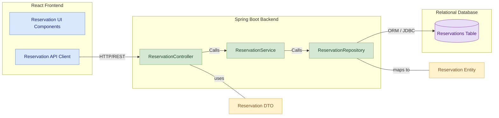

# Reservation Service Module

## Table of Contents
- [Module Overview](#module-overview)
- [Key Features](#key-features)
- [Table Design](#table-design)
  - [Reservation Table](#reservation-table)
- [Component Diagram](#component-diagram)
- [Layered Architecture of Reservation Module](#layered-architecture-of-reservation-module)
  - [1. Controller Layer](#1-controller-layer)
  - [2. Service Layer](#2-service-layer)
  - [3. Repository/Data Access Layer](#3-repositorydata-access-layer)
- [API Endpoints](#api-endpoints)
- [API Documentation](#api-documentation)

## Module Overview
The **Reservation Service Module** is a critical component of the Vehicle Parking Management System, dedicated to managing the booking and scheduling of parking slots. It provides functionalities for users to reserve available slots for specific time periods, and for administrators to oversee and manage these reservations. This module ensures that parking slots are allocated efficiently, prevents double-booking, and handles the lifecycle of a reservation from creation to completion or cancellation, integrating with the Parking Slot Module for real-time slot status updates.

## Key Features
- **Create Reservation:** Allows customers to reserve an available parking slot for a specified duration, marking the slot as occupied. Includes conflict checking to prevent overlapping reservations.
- **Update Reservation:** Enables customers and administrators to modify existing reservation details such as start/end times, vehicle number, or slot type.
- **Cancel Reservation:** Permits customers or administrators to cancel an active reservation, making the associated parking slot available again.
- **Retrieve All Reservations:** Provides administrators with a comprehensive list of all reservations in the system.
- **Retrieve Reservation by ID:** Allows fetching details of a specific reservation using its unique identifier.
- **Retrieve Reservations by User ID:** Enables customers and administrators to view all reservations made by a particular user.
- **Automated Expiry Handling:** Automatically marks expired active reservations as `COMPLETED` and frees up the associated parking slots.

## Table Design

### Reservation Table
| Column Name      | Data Type     | Constraints                        | Description                                     |
|------------------|---------------|------------------------------------|-------------------------------------------------|
| **reservationId**| BIGINT        | Primary Key, Auto Increment        | Unique identifier for the reservation           |
| **userId** | BIGINT        | Not Null, Foreign Key (User)       | Identifier of the user who made the reservation |
| **slotId** | BIGINT        | Not Null, Foreign Key (Parking Slot) | Identifier of the reserved parking slot         |
| **vehicleNumber**| VARCHAR(255)  | Not Null                           | The registration number of the vehicle          |
| **startTime** | DATETIME      | Not Null                           | The planned start time of the reservation       |
| **endTime** | DATETIME      | Not Null                           | The planned end time of the reservation         |
| **status** | VARCHAR(50)   | Not Null, Enum (ACTIVE, CANCELLED, COMPLETED) | Current status of the reservation          |
| **type** | VARCHAR(10)   | Nullable (e.g., "2W", "4W")        | Type of slot reserved (e.g., "2W", "4W")        |

## Component Diagram

## Layered Architecture of Reservation Module 

### 1. Controller Layer

**Purpose**:  
Handles HTTP requests, performs validation, and delegates processing to the Service Layer.

**Component**:  
`ReservationController`

**Endpoints**:
- `POST /api/reservations` – Create a new reservation (**CUSTOMER**)
- `GET /api/reservations` – Retrieve all reservations (**ADMIN**)
- `GET /api/reservations/{id}` – Get reservation by ID (**ADMIN or same CUSTOMER**)
- `DELETE /api/reservations/{id}` – Cancel reservation by ID (**ADMIN or CUSTOMER**)
- `PUT /api/reservations/{id}` – Update an existing reservation (**ADMIN or CUSTOMER**)
- `GET /api/reservations/user/{userId}` – Get reservations by user ID (**ADMIN or CUSTOMER**)

---

### 2. Service Layer

**Purpose**:  
Contains business logic, handles scheduling, interacts with repositories and external services (e.g., Slot Service).

**Components**:  
`ReservationService` (interface), `ReservationServiceImpl` (implementation)

**Key Methods**:
- `createReservation(ReservationRequestDTO)`
- `updateReservation(Long id, ReservationRequestDTO)`
- `cancelReservation(Long id)`
- `getReservationById(Long id)`
- `getAllReservations()`
- `getReservationsByUser(Long userId)`
- `completeExpiredReservations()` *(Scheduled Task)*

---

### 3. Repository/Data Access Layer

**Purpose**:  
Manages database interaction using Spring Data JPA.

**Component**:  
`ReservationRepository`

**Key Methods**:
- `findByUserId(Long userId)`
- `findBySlotIdAndStatus(Long slotId, ReservationStatus status)`
- `findByStatusAndEndTimeBefore(ReservationStatus status, LocalDateTime endTime)`
- `save()`, `findById()`, `findAll()` — via JPA

---

## API Endpoints

| HTTP Method | Endpoint                            | Description                                      | Request Body / Parameters                            | Access Roles     |
|-------------|--------------------------------------|--------------------------------------------------|------------------------------------------------------|------------------|
| POST        | `/api/reservations`                | Creates a new reservation                        | JSON: `ReservationRequestDTO`                        | CUSTOMER         |
| GET         | `/api/reservations`                | Retrieves all reservations                       | -                                                    | ADMIN            |
| GET         | `/api/reservations/{id}`           | Retrieves reservation by ID                      | Path param: `id`                                     | ADMIN, CUSTOMER  |
| DELETE      | `/api/reservations/{id}`           | Cancels a reservation                            | Path param: `id`                                     | ADMIN, CUSTOMER  |
| PUT         | `/api/reservations/{id}`           | Updates a reservation                            | Path param: `id`, JSON: `ReservationRequestDTO`      | ADMIN, CUSTOMER  |
| GET         | `/api/reservations/user/{userId}`  | Retrieves reservations by user                   | Path param: `userId`                                 | ADMIN, CUSTOMER  |

---

## API Documentation

For detailed API documentation, please refer to the 

[Reservation EndPoints Documentation](https://github.com/Nikitha-Kapparapu/VPMS/blob/main/reservation-service/Reservation%20Endpoints.md)

