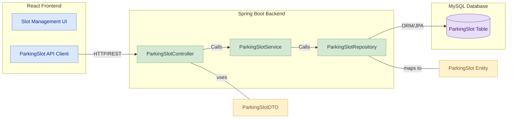

# Parking Slot Module 

## Table of Contents
- [Module Overview](#module-overview)
- [Key Features](#key-features)
- [Table Design](#table-design)
  - [Parking Slot Table](#parking-slot-table)
- [Component Diagram](#component-diagram)
- [Layered Architecture of Parking Slot Management Module](#layered-architecture-of-parking-slot-management-module)
  - [1. Controller Layer](#1-controller-layer)
  - [2. Service Layer](#2-service-layer)
  - [3. Repository/Data Access Layer](#3-repositorydata-access-layer)
- [API Endpoints](#api-endpoints)
- [API Documentation](#api-documentation)

## Module Overview
The **Parking Slot Module** is responsible for managing parking slot-related operations within the Vehicle Parking Management System. It provides functionalities such as adding new slots, updating slot status, fetching available slots (optionally by type), and deleting slots. This module supports role-based access to ensure that only authorized users can execute administrative operations.

## Key Features
- **Add Slot:** Allows administrators to add new parking slots with specified type and location.
- **Delete Slot:** Permits administrators to remove parking slots.
- **Update Slot Information:** Enables updating slot occupancy status and other details.
- **Fetch Available Slots:** Retrieves all unoccupied slots.
- **Fetch Available Slots By Type:** Allows filtering available slots based on the type (e.g., '2W' or '4W').
- **Mark Slot Occupancy:** Supports marking slots as occupied or available through dedicated endpoints.

## Table Design

### Parking Slot Table
| Column Name  | Data Type    | Constraints                    | Description                                  |
|--------------|--------------|--------------------------------|----------------------------------------------|
| **slotId**   | BIGINT       | Primary Key, Auto Increment    | Unique identifier for the parking slot       |
| **location** | VARCHAR(255) | Not Null                       | Location or identifier for the parking slot  |
| **type**     | VARCHAR(10)  | Not Null                       | Type of slot (e.g., "2W", "4W")                |
| **isOccupied** | BOOLEAN    | Not Null, Default false        | Indicates whether the slot is currently occupied |

## Component Diagram

## Layered Architecture of Parking Slot Management Module 

The module is implemented using a multi-layered architecture to ensure separation of concerns and promote scalability.

### 1. Controller Layer
- **Purpose:** Handles HTTP requests and maps them to the corresponding service methods.
- **Component:** `SlotController`
  - **Endpoints:**
    - `POST /api/slots`: Adds a new parking slot (ADMIN only).
    - `DELETE /api/slots/{slotId}`: Deletes a parking slot (ADMIN only).
    - `PUT /api/slots/{slotId}`: Updates slot details such as occupancy status (STAFF only).
    - `GET /api/slots/available`: Retrieves all available (unoccupied) slots (CUSTOMER only).
    - `GET /api/slots`: Retrieves all slots (both occupied and unoccupied) (ADMIN only).
    - `GET /api/slots/available/type/{type}`: Retrieves available slots filtered by type (open to all).

### 2. Service Layer
- **Purpose:** Contains the business logic for processing parking slot operations.
- **Component:** `SlotService` , `SlotServiceImpl`
  - **Methods Provided:**
    - `SlotResponseDTO addSlot(SlotRequestDTO requestDTO)`: Adds a new slot.
    - `void deleteSlot(Long slotId)`: Deletes a slot by its ID.
    - `SlotResponseDTO updateSlot(Long slotId, SlotRequestDTO requestDTO)`: Updates slot details.
    - `List<SlotResponseDTO> getAvailableSlots()`: Retrieves all unoccupied slots.
    - `List<SlotResponseDTO> getAllSlots()`: Retrieves all slots.
    - `List<SlotResponseDTO> getAvailableSlotsByType(String type)`: Retrieves available slots by slot type.
    - `SlotResponseDTO updateSlotOccupancy(Long slotId, Boolean occupied)`: Updates the occupancy status of a slot.
    - `SlotResponseDTO getSlotById(Long slotId)`: Fetches slot details by its ID.

### 3. Repository/Data Access Layer
- **Purpose:** Interacts with the database to perform CRUD operations on the Parking Slot entity.
- **Component:** `SlotRepository`
  - **Methods Provided:**
    - `List<Slot> findByIsOccupiedFalse()`: Retrieves all available (not occupied) slots.
    - `List<Slot> findByTypeAndIsOccupiedFalse(String type)`: Retrieves available slots filtered by type.
    - Standard CRUD methods inherited from Spring Data JPA.

## API Endpoints

| HTTP Method | Endpoint                                | Description                                                | Request Body / Parameters          |
|-------------|-----------------------------------------|------------------------------------------------------------|------------------------------------|
| POST        | `/api/slots`                            | Add a new parking slot (ADMIN only)                        | JSON: SlotRequestDTO               |
| DELETE      | `/api/slots/{slotId}`                   | Delete a parking slot (ADMIN only)                         | Path parameter: slotId             |
| PUT         | `/api/slots/{slotId}`                   | Update slot information (STAFF only)                       | JSON: SlotRequestDTO               |
| GET         | `/api/slots/available`                  | Fetch all available (unoccupied) slots (CUSTOMER only)     | -                                  |
| GET         | `/api/slots`                            | Get all slots (both occupied and unoccupied) (ADMIN only)  | -                                  |
| GET         | `/api/slots/available/type/{type}`      | Fetch available slots by type (open to all)                | Path parameter: type               |
| PUT         | `/api/slots/slot/{slotId}`              | Update slot occupancy (STAFF or ADMIN)                     | JSON: { "occupied": Boolean }      |
| PUT         | `/api/slots/mark-occupied/{slotId}`     | Mark the slot as occupied (CUSTOMER only)                  | Path parameter: slotId             |
| PUT         | `/api/slots/mark-available/{slotId}`    | Mark the slot as available                                 | Path parameter: slotId             |
| PUT         | `/api/slots/update-occupancy`           | Update slot occupancy via request parameters               | Request params: slotId, isOccupied |
| GET         | `/api/slots/{slotId}`                   | Get slot details by slot ID                                | Path parameter: slotId             |

## API Documentation
For detailed documentation on the API endpoints, please refer to the dedicated API documentation guide 

[Slot API Documentation](https://github.com/Bharadwajm-06/VPMS-FINAL/blob/main/VPMS/slot-service/Slot%20Endpoints.md)
