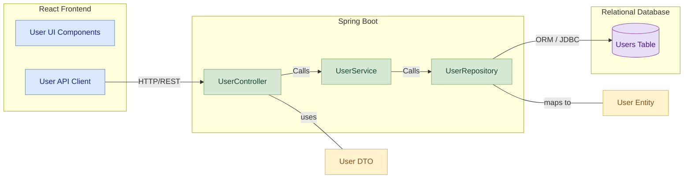

# User Management Module
## Table of Contents
- [Module Overview](#module-overview)
- [Key Features](#key-features)
- [Table Design](#table-design)
  - [User Table](#user-table)
- [Component Diagram](#component-diagram)
- [Layered Architecture of User management Module](#layered-architecture-of-user-management-module)
  - [1. Controller Layer](#1-controller-layer)
  - [2. Service Layer](#2-service-layer)
  - [3. Repository/Data Access Layer](#3-repositorydata-access-layer)
- [API EndPoints](#api-endpoints)
- [API Documentation of User Module](#api-documentation-of-user-module)

## Module Overview
The **User Management Module** is responsible for managing user-related operations within the Vehicle Parking Management System. It includes functionalities such as user registration, login, profile management, role assignment, and deletion. Leveraging Spring Security and JWT tokens, this module ensures secure authentication and authorization.

## Key Features
- **User Registration**: Allows new users to create an account.
- **User Login**: Authenticates users and generates JWT tokens.
- **Profile Management**: Retrieves and updates user profile information.
- **Role Assignment**: Enables administrators to assign or update user roles.
- **User Deletion**: Permits removal of user accounts (ADMIN only).

## Table Design

### User Table
| Column Name | Data Type    | Constraints                    | Description                           |
|-------------|--------------|--------------------------------|---------------------------------------|
| **id**      | BIGINT       | Primary Key, Auto Increment    | Unique identifier for the user        |
| **name**    | VARCHAR(255) | Not Null                       | Name of the user                      |
| **email**   | VARCHAR(255) | Unique, Not Null               | Email address of the user             |
| **password**| VARCHAR(255) | Not Null                       | Encrypted password for authentication |
| **role**    | ENUM         | Not Null                       | Role (e.g., ADMIN, CUSTOMER, STAFF)   |

## Component Diagram

## Layered Architecture of User Management Module

### 1. Controller Layer
- **Purpose**: Handles HTTP requests and maps them to service methods.
- **Component**: `AuthController`
  - **Endpoints**:
    - `POST /api/user/register`: Registers a new user.
    - `POST /api/user/login`: Authenticates user and returns a JWT.
    - `GET /api/user/profile`: Retrieves authenticated user’s profile.
    - `PUT /api/user/{id}`: Updates user details (self or ADMIN update).
    - `PUT /api/user/assign-role/{userId}`: Assigns/updates user role (ADMIN only).
    - `DELETE /api/user/{id}`: Deletes a user (ADMIN only).
    - `GET /api/user/{id}`: Retrieves user details by ID.
    - `GET /api/user/email/{email}`: Retrieves a user by email.

### 2. Service Layer
- **Purpose**: Contains business logic for processing user operations.
- **Component**: `AuthService`
  - Implements methods for user registration, authentication, profile management, updating, and deletion.

### 3. Repository/Data Access Layer
- **Purpose**: Interacts with the database to perform CRUD operations on the `User` entity.
- **Component**: `UserRepository`
  - **Methods**:
    - `findByEmail(String email)`: Returns a user by email.
    - `findById(Long id)`: Returns a user by their unique identifier.
    - Standard CRUD operations provided by Spring Data JPA.

## API EndPoints

| HTTP Method | Endpoint                           | Description                                       | Request Body/Params              |
|-------------|------------------------------------|---------------------------------------------------|----------------------------------|
| POST        | `/api/user/register`               | Register a new user                               | JSON: registration details       |
| POST        | `/api/user/login`                  | Authenticate user and generate a JWT token        | JSON: login credentials          |
| GET         | `/api/user/profile`                | Get authenticated user's profile                  | JWT in Authorization Header      |
| PUT         | `/api/user/{id}`                   | Update user's details (self or ADMIN)             | JSON: fields to update           |
| PUT         | `/api/user/assign-role/{userId}`   | Assign or update user role (ADMIN only)           | Request Param: role              |
| DELETE      | `/api/user/{id}`                   | Delete a user account (ADMIN only)                | -                                |
| GET         | `/api/user/{id}`                   | Get user details by ID                            | -                                |
| GET         | `/api/user/email/{email}`          | Get user details by email                         | -                                |

## API Documentation of User Module
For detailed API documentation, please refer to the 

[User EndPoints Documentation](../user-service/User%20Endpoints.md)