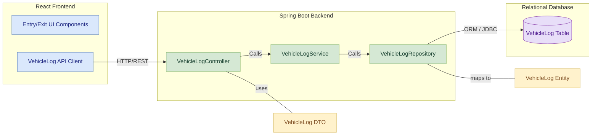

# Vehicle Log Entry & Exit Module

## Table of Contents
- [Module Overview](#module-overview)
- [Key Features](#key-features)
- [Table Design](#table-design)
  - [Vehicle Log Table](#vehicle-log-table)
- [Component Diagram](#component-diagram)
- [Layered Architecture of Vehicle Log Module](#layered-architecture-of-vehicle-log-module)
  - [1. Controller Layer](#1-controller-layer)
  - [2. Service Layer](#2-service-layer)
  - [3. Repository/Data Access Layer](#3-repositorydata-access-layer)
- [API Endpoints](#api-endpoints)
- [API Documentation](#api-documentation)

## Module Overview
The **Vehicle Log Entry & Exit Module** is a core component of the Vehicle Parking Management System, responsible for meticulously recording vehicle movements within the parking facility. It manages the lifecycle of a vehicle's stay, from entry to exit, including capturing timestamps, associating vehicles with specific slots and users, and calculating parking durations. This module integrates with the Parking Slot Module to update slot occupancy status in real-time.

## Key Features
- **Log Vehicle Entry:** Records the entry of a vehicle into a parking slot, marking the associated slot as occupied.
- **Log Vehicle Exit:** Records the exit of a vehicle from a parking slot, marking the associated slot as available and calculating the parking duration.
- **Retrieve All Logs:** Allows administrators to fetch a comprehensive list of all vehicle entry and exit logs.
- **Retrieve Log by ID:** Enables fetching details of a specific vehicle log using its unique identifier.
- **Retrieve Logs by User:** Provides functionality to retrieve all parking logs associated with a specific user.
- **Update Vehicle Log:** Allows staff and administrators to modify details of an existing vehicle log, including reassigning slots.

## Table Design

### Vehicle Log Table
| Column Name    | Data Type     | Constraints                    | Description                                     |
|----------------|---------------|--------------------------------|-------------------------------------------------|
| **logId** | BIGINT        | Primary Key, Auto Increment    | Unique identifier for the vehicle log entry     |
| **vehicleNumber**| VARCHAR(255)  | Not Null                       | The registration number of the vehicle          |
| **entryTime** | DATETIME      | Not Null                       | Timestamp when the vehicle entered the parking  |
| **exitTime** | DATETIME      | Nullable                       | Timestamp when the vehicle exited the parking   |
| **userId** | BIGINT        | Not Null, Foreign Key (User)   | Identifier of the user associated with the log  |
| **slotId** | BIGINT        | Not Null, Foreign Key (Parking Slot) | Identifier of the parking slot used             |

## Component Diagram

## Layered Architecture of Vehicle Log Module

### 1. Controller Layer

**Purpose**:  
Handles incoming HTTP requests related to vehicle log operations, validates input, and delegates the business logic to the service layer. It also formats API responses for the client.

**Component**:  
`VehicleLogController`

**Responsibilities**:
- Handle REST API endpoints
- Validate request payloads
- Map DTOs to service objects
- Return structured responses to the client

**Endpoints**:
- `POST /api/vehicle-log/entry` – Logs vehicle entry (`STAFF`, `ADMIN`)
- `POST /api/vehicle-log/exit` – Logs vehicle exit (`STAFF`)
- `GET /api/vehicle-log` – Retrieves all vehicle logs (`ADMIN`)
- `GET /api/vehicle-log/{id}` – Fetch log by ID (`ADMIN`)
- `PUT /api/vehicle-log/{id}` – Update vehicle log (`STAFF`, `ADMIN`)
- `GET /api/vehicle-log/user/{userId}` – Fetch logs by user (`ALL` roles)

---

### 2. Service Layer

**Purpose**:  
Contains the core business logic for vehicle log processing. It serves as an intermediary between the controller and the data access layer.

**Components**:  
- Interface: `VehicleLogService`
- Implementation: `VehicleLogServiceImpl`

**Responsibilities**:
- Process vehicle entry/exit logic
- Enforce business rules
- Coordinate with external services (e.g., Parking Slot Module)

**Key Methods**:
- `logVehicleEntry(VehicleEntryRequest request)`
- `logVehicleExit(VehicleExitRequest request)`
- `getAllLogs()`
- `getLogById(Long id)`
- `updateLogById(Long id, VehicleLogResponse updateRequest)`
- `getLogsByUserId(Long userId)`

---

### 3. Repository/Data Access Layer

**Purpose**:  
Manages direct interaction with the database. Responsible for CRUD operations related to `VehicleLog` entities.

**Component**:  
`VehicleLogRepository` (Spring Data JPA)

**Responsibilities**:
- Abstract database queries using JPA/Hibernate
- Provide custom query methods

**Key Methods**:
- `findByUserId(Long userId)`
- `findBySlotId(Long slotId)`
- `findByVehicleNumber(String vehicleNumber)`
- Inherited CRUD: `save()`, `findById()`, `findAll()`, etc.

## API Endpoints

Below is a list of RESTful API endpoints exposed by the Vehicle Log Entry & Exit Module. Each endpoint is mapped to specific roles and responsibilities.

| HTTP Method | Endpoint                           | Description                                   | Request Body / Params                        | Access Roles     |
|-------------|-------------------------------------|-----------------------------------------------|----------------------------------------------|------------------|
| POST        | `/api/vehicle-log/entry`           | Logs vehicle entry                            | JSON: `VehicleEntryRequest`                  | STAFF, ADMIN     |
| POST        | `/api/vehicle-log/exit`            | Logs vehicle exit                             | JSON: `VehicleExitRequest`                   | STAFF            |
| GET         | `/api/vehicle-log`                 | Retrieves all vehicle logs                    | -                                            | ADMIN            |
| GET         | `/api/vehicle-log/{id}`            | Retrieves a specific vehicle log by ID        | Path param: `id`                             | ADMIN            |
| PUT         | `/api/vehicle-log/{id}`            | Updates vehicle log by ID                     | Path param: `id`, JSON: `VehicleLogResponse` | STAFF, ADMIN     |
| GET         | `/api/vehicle-log/user/{userId}`   | Retrieves vehicle logs for a specific user    | Path param: `userId`                         | ADMIN, STAFF, CUSTOMER |

---

## API Documentation

For detailed API documentation, please refer to the
 
[VehicleLog EndPoints Documentation](https://github.com/VaishnaviReddy8864/VPMS/blob/main/vehicle-log-service/VehicleLog%20Endpoints.md)

 